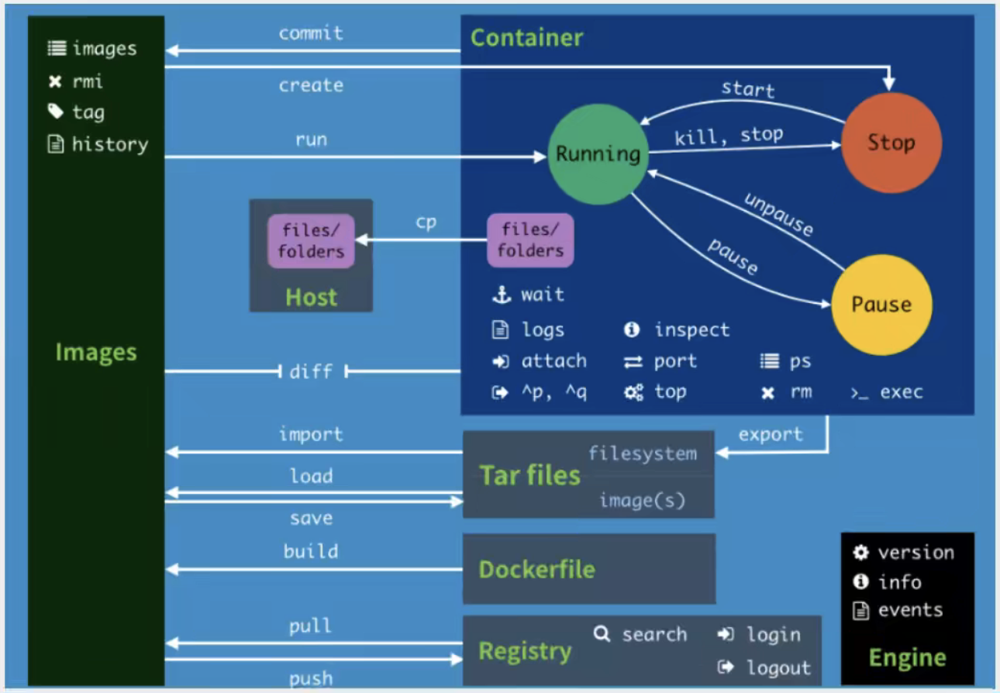

# Docker 常用命令

## 帮助命令

```shell
$ docker version     # 显示 Docker 版本信息
$ docker info        # 显示 Docker 系统信息
$ docker INSTUMENTS --help # 帮助命令
```

查询[官方参考文档 ](https://docs.docker.com/reference/)。

## 镜像命令

**docker images：**

```shell
# 查看所有本地镜像
$ docker images    
REPOSITORY   TAG       IMAGE ID       CREATED       SIZE
nginx        latest    6efc10a0510f   3 weeks ago   142MB

# 解释
REPOSITORY  镜像仓库名
TAG         镜像标签
IMAGE ID    镜像 ID
CREATED     镜像创建时间
SIZE        镜像大小

# 常用可选项
-a, --all             Show all images (default hides intermediate images)
-q, --quiet           Only show image IDs
```

**docker search:**

```shell
# 搜索镜像
$ docker search mysql
NAME    DESCRIPTION                                     STARS     OFFICIAL   AUTOMATED
mysql   MySQL is a widely used, open-source relation…   14102     [OK]
mariadb MariaDB Server is a high performing open sou…   5387      [OK]

# 常用可选项
--filter=STARS=3000  # stars 大于等于 3000 的镜像
```

**docker pull:**

```shell
# 拉取（下载）镜像：docker pull 镜像名[:tag]
$ docker pull mysql
Using default tag: latest  # 如果不写 tag，默认为 latest
latest: Pulling from library/mysql
328ba678bf27: Pull complete  # 分层下载，Docker image 的核心，联合文件系统
f3f5ff008d73: Pull complete
dd7054d6d0c7: Pull complete
70b5d4e8750e: Pull complete
cdc4a7b43bdd: Pull complete
a0608f8959e0: Pull complete
5823e721608f: Pull complete
a564ada930a9: Pull complete
539565d00e89: Pull complete
a11a06843fd5: Pull complete
92f6d4aa041d: Pull complete
Digest: sha256:a43f6e7e7f3a5e5b90f857fbed4e3103ece771b19f0f75880f767cf66bbb6577
Status: Downloaded newer image for mysql:latest
docker.io/library/mysql:latest  # 真实地址

# 等价命令
docker pull mysql
ducker pull docker.io/library/mysql:latest

# 指定版本下载
docker pull mysql:5.7
```

**docker rmi:**

```shell
# 删除镜像
$ docker rmi IMAGE_ID [IMAGE_ID]

# 删除全部镜像
$ docker rmi $(docker images -aq)
```

## 容器命令

> 有了镜像才可以创建容器，此处使用 CentOS 来实验

**拉取镜像：**

```shell
$ docker pull centos
```

**新建容器并启动：**

```shell
# docker run [可选参数] IMAGE

# 常用可选项
--name="NAME"  # 容器名字，用来区分不同的容器
-d             # 以后台方式运行
-it            # 使用交互方式运行，进入容器查看内容
-p             # 指定容器的端口
  -p 主机端口：容器端口（常用）
  -p 容器端口
  -p ip：主机端口：容器端口
  容器端口
  
# 测试
$ docker run --name="CentOS" -it centos /bin/bash  # 启动并进入容器
[root@c3369563adf2 /]# ls
bin  dev  etc  home  lib  lib64  lost+found  media  mnt  opt  proc  root  run  sbin  srv  sys  tmp  usr  var
# 从容器中退出
[root@c3369563adf2 /]# exit
exit
```

**查看正在运行的容器：**

```shell
# 查看当前正在运行的容器
$ docker ps

# 查看曾经运行过的容器
$ docker ps -a
CONTAINER ID  IMAGE  COMMAND      CREATED        
c3369563adf2  centos "/bin/bash"  3 minutes ago 
STATUS                         PORTS      NAMES
Exited (0) About a minute ago             CentOS

# 常用可选项
-a   # 列出当前运行的和历史运行过的容器
-q   # Only show image IDs
-n   # Show n last created containers (includes all states) (default -1)
```

**退出容器：**

```shell
exit  # 直接停止容器并退出
Ctrl + P + Q  # 退出但不停止容器
```

**删除容器：**

```shell
docker rm 容器ID
docker rm $(docker ps -aq)
```

**启动和停止容器：**

```shell
docker start 容器id
docker restart 容器id
docker stop 容器id
docker kill 容器id
```

## 常用其他命令

**后台启动容器：**

```shell
# docker run -d 镜像名
$ docker run -d centos
2056864ef18c bf9c36ecfa2a40948a1aef755e8b6e7d698385be64669966eadf

$ docker ps -a  # 发现镜像已经停止了
CONTAINER ID   IMAGE     COMMAND       CREATED          STATUS                      PORTS     NAMES
2056864ef18c   centos    "/bin/bash"   16 seconds ago   Exited (0) 16 seconds ago             unruffled_dubinsky
# 原因：Docker 容器使用后台运行，必须需要有一个前台进程，否则自动停止
```

**查看日志：**

```shell
# docker logs [OPTIONS] CONTAINER

# 常用可选项
    --details        Show extra details provided to logs
-f, --follow         Follow log output
    --since string   Show logs since timestamp (e.g. "2013-01-02T13:23:37Z") or relative (e.g. "42m" for 42 minutes)
-n, --tail string    Number of lines to show from the end of the logs (default "all")
-t, --timestamps     Show timestamps
    --until string   Show logs before a timestamp (e.g. "2013-01-02T13:23:37Z") or relative (e.g. "42m" for 42 minutes)
```

**查看容器中进程信息：**

```shell
# docker top CONTAINER

$ docker run -it centos /bin/bash
[root@5d857a74a7ff /]# %

~ took 4s
$ docker ps
CONTAINER ID   IMAGE     COMMAND       CREATED         STATUS         PORTS     NAMES
5d857a74a7ff   centos    "/bin/bash"   7 seconds ago   Up 7 seconds             objective_goldberg

~
$ docker top 5d857a74a7ff
UID                 PID                 PPID                C                   STIME               TTY                 TIME                CMD
root                83209               83183               0                   05:13               ?                   00:00:00            /bin/bash
```

**查看镜像中的元数据：**

```shell
# docker inspect [OPTIONS] NAME|ID [NAME|ID]
```

**进入当前正在运行的容器：**

> 容器通常都是使用后台方式运行的

```shell
# 方式 1：
# docker exec [OPTIONS] CONTAINER COMMAND [ARG...]
# Execute a command in a running container

$ docker ps
CONTAINER ID   IMAGE     COMMAND       CREATED         STATUS         PORTS     NAMES
5d857a74a7ff   centos    "/bin/bash"   8 minutes ago   Up 8 minutes             objective_goldberg

~
$ docker exec -it 5d857a74a7ff /bin/bash
[root@5d857a74a7ff /]# ls
bin  dev  etc  home  lib  lib64  lost+found  media  mnt  opt  proc  root  run  sbin  srv  sys  tmp  usr  var
[root@5d857a74a7ff /]#
# 方式 2：
# docker attach [OPTIONS] CONTAINER
# Attach local standard input, output, and error streams to a running container

$ docker attach 5d857a74a7ff
[root@5d857a74a7ff /]# ls
bin  dev  etc  home  lib  lib64  lost+found  media  mnt  opt  proc  root  run  sbin  srv  sys  tmp  usr  var
[root@5d857a74a7ff /]#
```

区别：

- docker exec: 进入容器后开启一个新的终端**（常用）**
- docker attach: 进入容器正在执行的中断，不会启动新的进程

**从容器与主机间文件拷贝：**

```shell
# docker cp [OPTIONS] CONTAINER:SRC_PATH DEST_PATH|- （常用）
# docker cp [OPTIONS] SRC_PATH|- CONTAINER:DEST_PATH
# Copy files/folders between a container and the local filesystem

Use '-' as the source to read a tar archive from stdin
and extract it to a directory destination in a container.
Use '-' as the destination to stream a tar archive of a
container source to stdout.

# 进入容器
$ docker attach 5d857a74a7ff
[root@5d857a74a7ff /]# touch test.java  # 新建文件
[root@5d857a74a7ff /]# ls
bin  dev  etc  home  lib  lib64  lost+found  media  mnt  opt  proc  root  run  sbin  srv  sys  test.java  tmp  usr  var
[root@5d857a74a7ff /]# read escape sequence  # 退出容器

~ took 1m8s
# 拷贝文件
$ docker cp 5d857a74a7ff:./test.java ~/Desktop
Successfully copied 1.54kB to /Users/kendrick_song/Desktop

~
# 检查
$ ls ~/Desktop
test.java
```

## 小结



## 练习

**下载 Nginx：**

```shell
# 1. search
$ docker search nginx

~
# 2. pull
$ docker pull nginx

~ took 22s
# 3. run
$ docker run -d --name nginx01 -p 3344:80 nginx
edcdd5562031e9ef2106036a0b9c69fbb9f4456ea3879f4d3932df65a9fd6bbb

~
$ docker ps
CONTAINER ID   IMAGE     COMMAND                   CREATED         STATUS         PORTS                  NAMES
edcdd5562031   nginx     "/docker-entrypoint.…"   3 seconds ago   Up 2 seconds   0.0.0.0:3344->80/tcp   nginx01

~
# 4. test
$ curl localhost:3344
<!DOCTYPE html>
<html>
<head>
<title>Welcome to nginx!</title>
<style>
html { color-scheme: light dark; }
body { width: 35em; margin: 0 auto;
font-family: Tahoma, Verdana, Arial, sans-serif; }
</style>
</head>
<body>
<h1>Welcome to nginx!</h1>
<p>If you see this page, the nginx web server is successfully installed and
working. Further configuration is required.</p>

<p>For online documentation and support please refer to
<a href="http://nginx.org/">nginx.org</a>.<br/>
Commercial support is available at
<a href="http://nginx.com/">nginx.com</a>.</p>

<p><em>Thank you for using nginx.</em></p>
</body>
</html>

# 5. 进入容器
$ docker exec -it nginx01 /bin/bash
root@edcdd5562031:/# whereis nginx
nginx: /usr/sbin/nginx /usr/lib/nginx /etc/nginx /usr/share/nginx
root@edcdd5562031:/# cd /etc/nginx/
root@edcdd5562031:/etc/nginx# ls
conf.d	fastcgi_params	mime.types  modules  nginx.conf  scgi_params  uwsgi_params
root@edcdd5562031:/etc/nginx#
```

**下载 Tomcat：**

```shell
# 官方使用：docker run -it --rm tomcat:9.0
# --rm  Automatically remove the container when it exits
# 一般用于测试

$ docker pull tomcat
$ docker run -d --name tomcat01 -p 3355:8080 tomcat
# 测试访问没有问题后，进入容器
$ docker exec -it tomcat01 /bin/bash
root@67d062c5fc67:/usr/local/tomcat# ls
BUILDING.txt  CONTRIBUTING.md  LICENSE	NOTICE	README.md  RELEASE-NOTES  RUNNING.txt  bin  conf  lib  logs  native-jni-lib  temp  webapps  webapps.dist  work
# 构建已有 webapp
root@67d062c5fc67:/usr/local/tomcat# cp -r webapps.dist/* webapps
```

**下载 ES+Kibana：**

```shell
# ES 暴露的端口很多，十分耗内存
# ES 的数据一般需要放置在安全目录，需要用到挂载
```