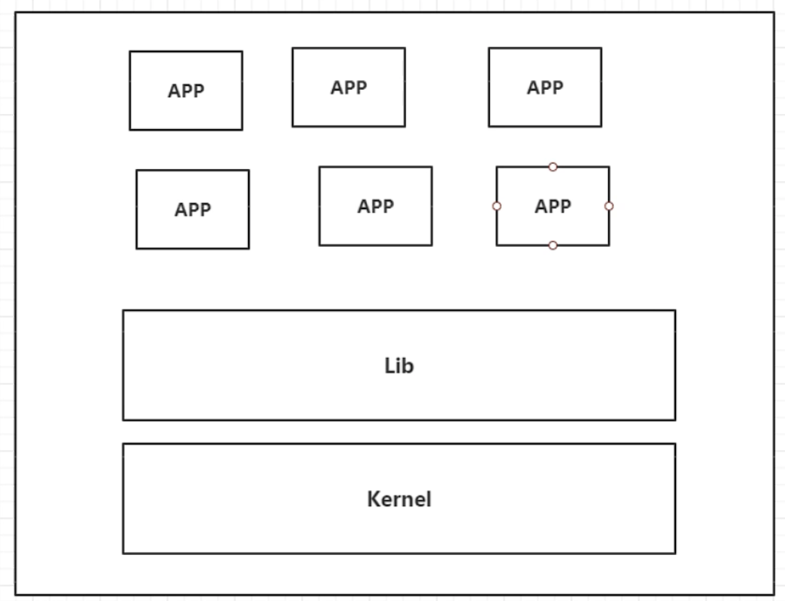
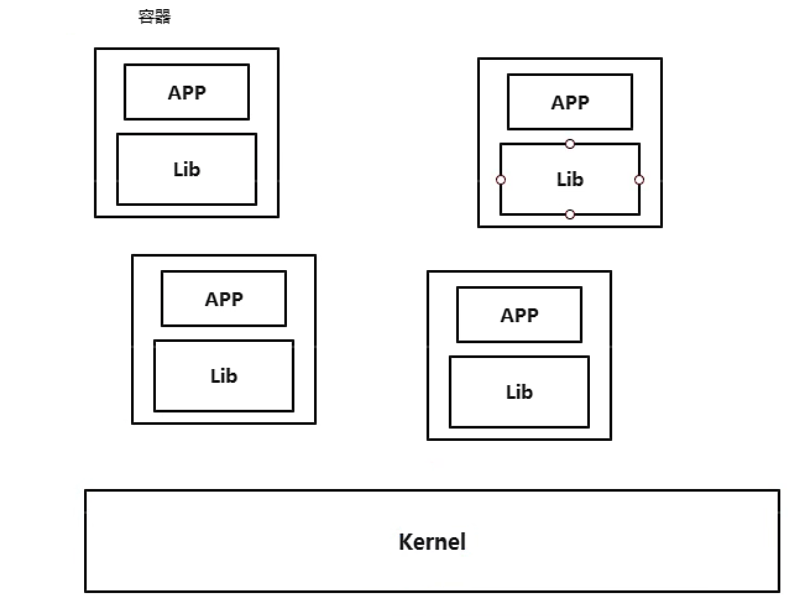
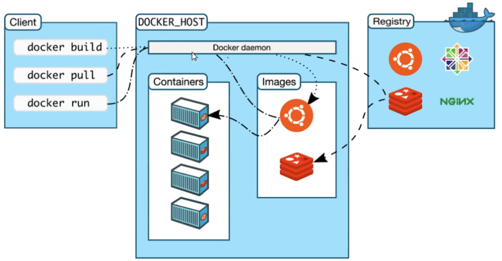
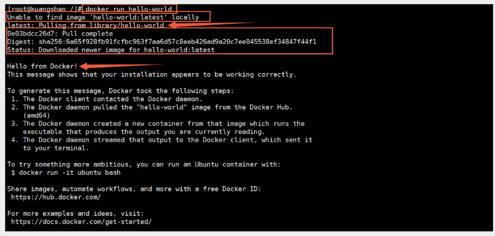
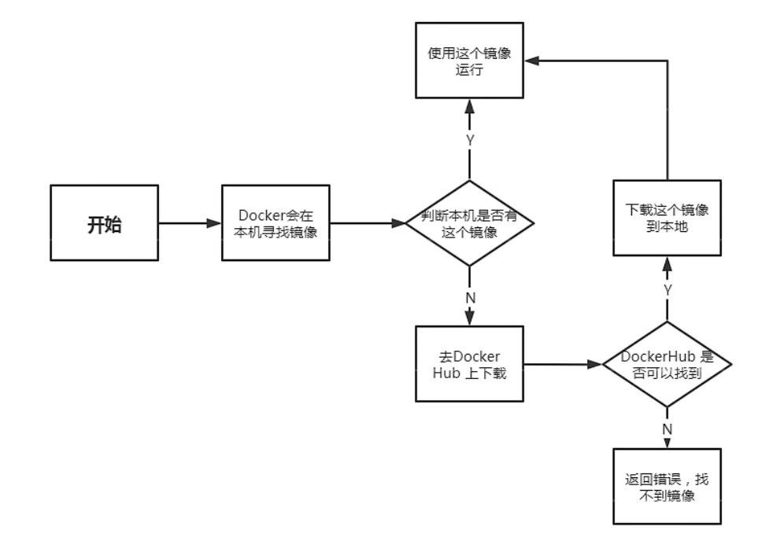
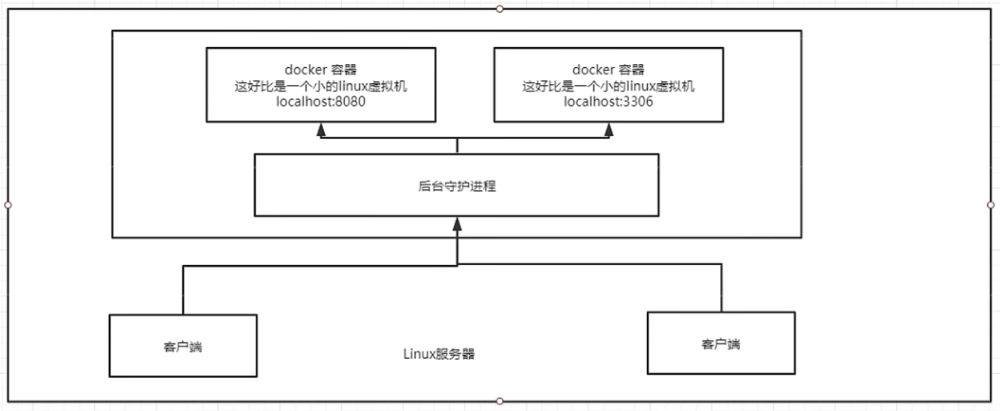
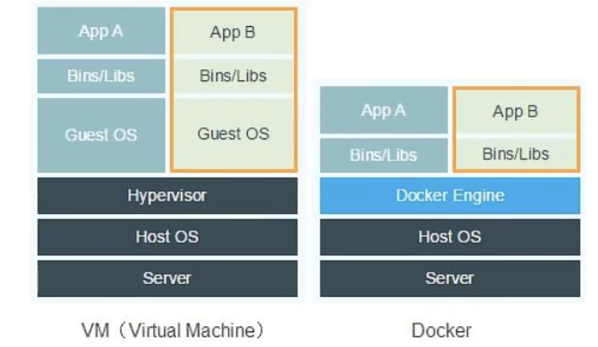

# Docker 概述

## Docker 为什么会出现

> 所有新技术的出现都是为了解决当时存在的一些问题

早期产品开发流程：开发 --> 上线，共两套环境。**开发环境**和**运维环境**不同。

**问题：我本地能跑通啊！为什么你那里不可以！/ 版本更新导致服务不可用**

本质上是因为环境配置十分麻烦，且很浪费时间，尤其是集群

**解决方案：能不能再发布产品的时候带上环境呢？**

Docker 出现

打包项目带上环境（镜像），环境（镜像）发布在 Docker 仓库，可从中下载镜像

**核心思想：隔离**。通过隔离机制，可以将服务器性能压榨到极致

**核心优点：轻量**。在容器技术出现之前，主流使用虚拟机技术

虚拟机：通过软件在已有系统中虚拟出一台或多台电脑，包含所有内容，十分笨重

Docker：镜像只包括运行程序最核心的环境，轻便

## Docker 发展历程

2010 年，在美国成立公司 `dotcloud`，主营 PaaS 云计算服务，Linux 相关的容器化技术，后期将该技术命名为 `Docker`。

Docker 诞生之初并没有引起行业注意，为了公司存活，不得已将 Docker 被开源，越来越多的人发现了 Docker 的优点，关注的人越来越多，社区十分活跃。

2014 年 4 月 9 日，Docker 1.0 正式发布。

Docker 是基于 Go 语言开发的开源项目，[官方文档](https://docs.docker.com/)十分详细

## Docker 能做什么

**传统虚拟机结构：**

缺点：

1. 资源占用多
1. 冗余步骤多
1. 启动慢

**容器化虚拟技术结构：**

**容器化技术不是模拟一个完整的操作系统。**

比较传统虚拟机与 Docker 容器技术：

- 传统虚拟机会虚拟出一套硬件，运行一个完整的操作系统，在该系统上安装和运行软件
- 容器内的应用直接运行在宿主机，容器没有虚拟硬件，仅包含运行软件所需的必要程序，所以轻便
- 每个容器间互相隔离，每个容器内部都有一个属于自己的文件系统，互不影响

> **DevOps（开发、运维）**
>
> - 应用能够更快速的交付和部署
>
> 传统：一堆帮助文档，安装程序
>
> Docker：打包镜像，发布测试，一键运行
>
> - 更便捷的升级和扩缩容
>
> 项目打包为一个镜像，通过『搭积木』的方式进行扩容（缩容）
>
> - 更简单的系统运维
>
> 容器化之后，开发、测试环境都高度一致
>
> - 更高效的计算资源利用
>
> Docker 是内核级别的虚拟化，宿主机的资源分配粒度更细，利用率更高

## Docker 基本组成

**镜像（image）:**

Docker 镜像就好比是一个模板，可以通过这个模板来创建容器服务。

通过一个镜像可以创建多个容器，最终服务运行就是在容器中。

**容器（container）：**

Docker 利用容器技术，独立运行一个或者一组应用的实例。

可以简单理解为是一个简易的 Linux 系统。

**仓库（repository）：**

仓库是存放镜像的地方，分为公有仓库和私有仓库

## Hello World 流程

`run`命令的运行流程图：

## Docker 怎么工作的

Docker 是一个 Client-Server 结构的系统，Docker 的守护进程运行在主机上，通过 Socket 从客户端访问。

Docker-Server 接收到 Docker-Client 的指令，就会执行。

**Docker 为什么比虚拟机快：**

1. Docker 比虚拟机的抽象层更少。
1. Docker 利用的是宿主机的内核，虚拟机需要 Guest OS。所以新建容器的时候，Docker 不需要加载一个操作系统内核，避免引导。