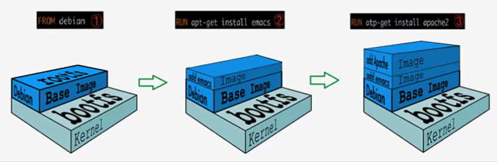

# Docker 镜像

## Docker 镜像加载原理

> UnionFS（联合文件系统）

Union 文件系统是 Docker 镜像的基础，镜像可以通过分层来进行继承，基于基础镜像可以制作各种具体的应用镜像。拉取镜像时看到的一层层的就是这个。

特性：一次同时加载多个文件系统，但从外部看，只能看到一个文件系统，联合加载会把各层文件系统叠加起来，最终的文件系统会包括所有底层的文件和目录。

UnionFS 主要包括以下两个文件系统：

**BootFS：**

位于 Docker 镜像的最底层。主要作用是引导加载系统内核，包含加载器和内核，在加载完成后内核就在内存中了，此时内存的使用权已由 BootFS 转交给内核，系统会卸载 BootFS。不同的 OS 可以共用几乎相同的 BootFS。

**RootFS：**

位于 BootFS 之上，是各种不同操作系统的发行版，比如 Ubuntu，CentOS等等，包含系统中的标准目录及文件。



对于一个精简的 OS，RootFS 可以很小，因为它只需要包含最基本的命令、工具和程序库就足够了，不需要引导相关的文件。

## 分层理解

```shell
$ docker inspect redis
...
        "RootFS": {
            "Type": "layers",
            "Layers": [
                "sha256:2edcec3590a4ec7f40cf0743c15d78fb39d8326bc029073b41ef9727da6c851f",
                "sha256:9b24afeb7c2f21e50a686ead025823cd2c6e9730c013ca77ad5f115c079b57cb",
                "sha256:4b8e2801e0f956a4220c32e2c8b0a590e6f9bd2420ec65453685246b82766ea1",
                "sha256:529cdb636f61e95ab91a62a51526a84fd7314d6aab0d414040796150b4522372",
                "sha256:9975392591f2777d6bf4d9919ad1b2c9afa12f9a9b4d260f45025ec3cc9b18ed",
                "sha256:8e5669d8329116b8444b9bbb1663dda568ede12d3dbcce950199b582f6e94952"
...
```

所有的 Docker 镜像都起始于一个基础镜像层，当进行修改或增加新的内容时，就会在当前镜像层之上，创建新的层。

**Docker 镜像都是只读的**。容器启动时，一个新的可写层被加载到镜像的顶部，这一层就是常说的**容器层**，容器层之下都叫镜像层。

## 提交镜像

```shell
# docker commit [OPTIONS] CONTAINER [REPOSITORY[:TAG]]
# docker commit -m="xx" -a="author" CONTAINER [REPOSITORY[:TAG]]
```

实例测试：

```shell
# 启动默认 Tomcat
$ docker run -d --name tomcat01 -p 3355:8080 tomcat
# 拷贝 webapps.dist/* 到 webapps
$ cp -r webapps.dist/* webapps/
# docker commit -a="author" -m="add webapps app" tomcat01 tomcat02:1.0
```

> 如果想要保存当前容器的状态，就可以通过 commit 来提交，获得一个镜像，类似于 VM 的快照。