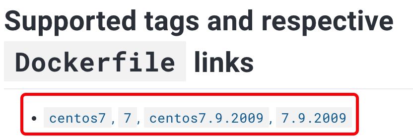
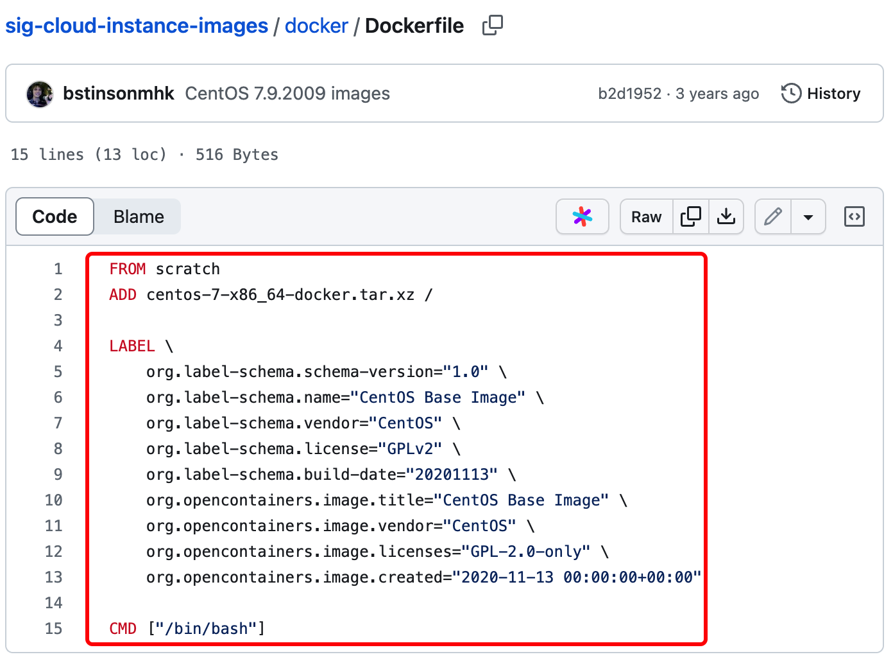
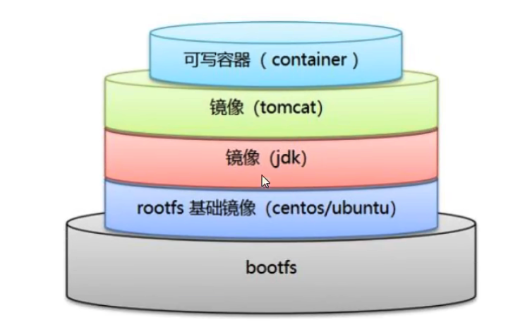
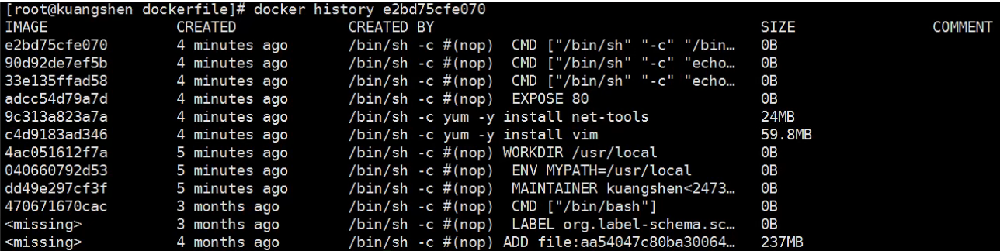
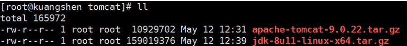

# DockerFile

## DockerFile 介绍

DockerFile 是用来构建 Docker 镜像的文件

构建步骤：

1. 编写 DockerFile 文件
1. `docker build` 构建镜像
1. `docker run` 运行镜像
1. `docker push` 发布镜像

官方镜像 DockerFile 查看：





> 很多官方镜像都是基础包，很多功能没有，需要自行添加。

## DockerFile 构建过程

### 基础知识：

- 每个保留关键字（指令）都必须是大写字母
- 执行是从上到下顺序执行
- `#` 表示注释
- 每个指令都会创建提交一个新的镜像层



DockerFile 是面向开发的，发布项目做镜像需要编写 DockerFile 文件。

**DockerFile**：构建文件，定义镜像

**Docker Images**：通过 DockerFile 构建生成的镜像

**Docker 容器：** 容器是镜像的实例

## DockerFile 指令

```dockerfile
FROM xx			# 基础镜像，一切从这里开始构建
MAINTAINER xx	# 镜像维护者信息,通常是姓名+邮箱
RUN xx			# 镜像构建时需要运行的命令（你想让它做什么）
ADD xx			# 添加内容，比如 Tomcat
WORKDIR xx		# 设置镜像当前工作目录
VOLUME xx		# 设置卷，要挂载的目录
EXPOSE xx		# 指定暴露端口
RUN xx			# 指定容器启动后要运行的程序
CMD xx			# 指定容器启动后要运行的命令，只有最后一条会生效
ENTRYPOINT xx	# 指定容器启动后要运行的命令，可以追加命令
ONBUILD	xx		# 当构建一个被继承的 DockerFile 时，该指令会被触发
COPY xx			# 将文件拷贝到镜像中
ENV xx			# 构建的时候设置环境变量
```

### 练习

> Docker Hub 中 99% 的镜像都是从 `FROM scratch` 开始的

**创建一个自己的 CentOS：**

1. 编写配置文件

```dockerfile
FROM centos
MAINTAINER kendrcik<xxx@xxx.com>

ENV MYPATH /usr/local
WORKDIR $MYPATH

RUN yum -y install vim
RUN yum -y install net-tools

EXPOSE 80

CMD echo $MYPATH
CMD echo "-----end-----"
CMD /bin/bash
```

2. 构建

```shell
# docker build [OPTIONS] PATH | URL | -
-f	Name of the Dockerfile (Default is PATH/Dockerfile)

docker build -f 文件路径 -t 镜像名:[tag] PATH
```

3. 测试运行

```shell
docker run -it 镜像 
```

4. 查看镜像构建历史

```shell
docker history 镜像
```



**自制 Tomcat 镜像：**

1. 准备镜像文件，Tomcat 压缩包，JDK 压缩包



2. 编写 DockerFile 文件

```dockerfile
FROM  centos
MAINTAINER kendrick<xxx@xxx.com>

COPY readme.txt /usr/local/readme.txt

ADD jdk-8ull-linux-x64.tar.gz /usr/local
ADD apache-tomcat-xxx /usr/local

RUN yum-y install vim

ENV MYPATH /usr/local
WORKDIR $MYPATH

ENV JAVA_HOME /usr/local/jdk1.8.0_11
ENV CLASSPATH $JAVA_HOME/lib/dt.jar:$JAVA_HOME/lib/tools.jar
ENV CATALINA_HOME /usr/local/apache-tomcat-xxx
ENV CATALINA_BASH /usr/local/apache-tomcat-xxx
ENV PATH $PATH:$JAV_HOME/bin:$CATALINA_HOME/lib:$CATALINA_BASH/bin

EXPOSE 8080

CMD /$CATALINA_HOME/bin/startup.sh && tail -F /usr/local/apache-tomcat-xxx/bin/logs/catalina.out
```

3. 构建镜像

## 发布镜像

1. 登录 Docker Hub：`docker login`
1. 提交镜像：`docker push`