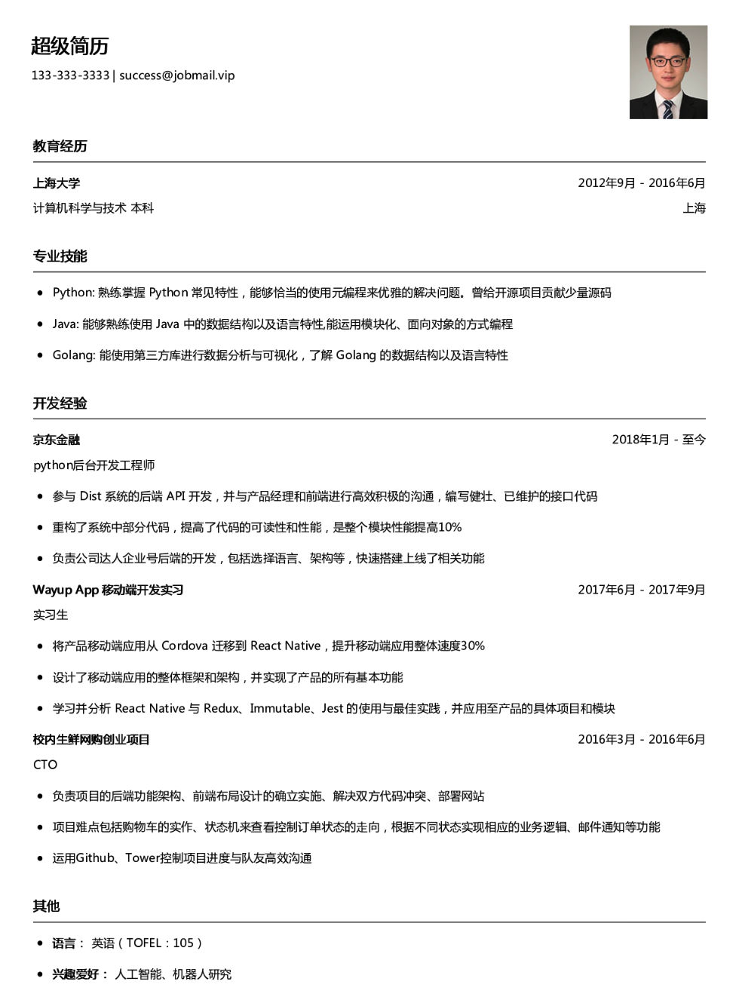
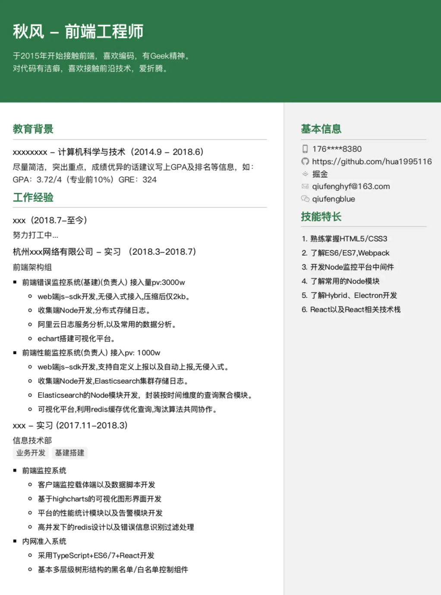
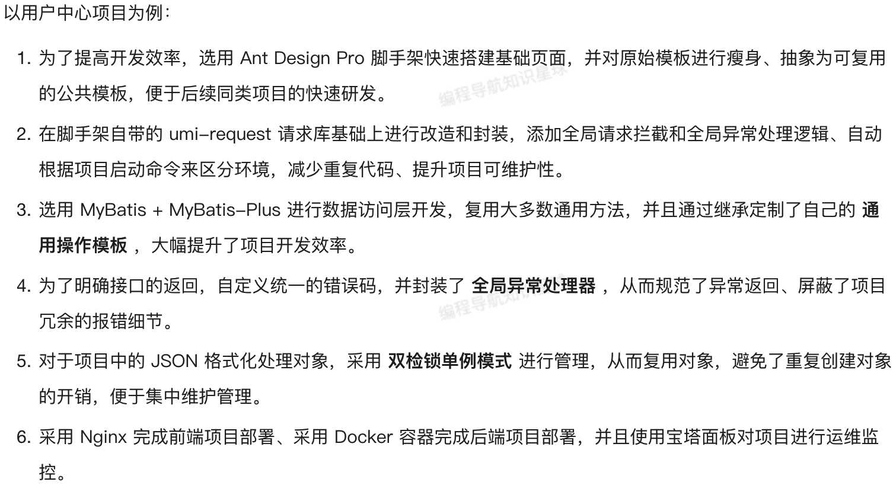

# 简历编写指南

[[toc]]

## 简历文件

### 简历模板

简历模板千万不要很花哨，很扎眼，只要保证简历结构是从上到下、布局清晰、排版整齐、简洁干净就好。

✅ [推荐样式](https://www.wondercv.com/jianlimoban/jqZb6WM.html)：

❌ 不推荐样式：

### 简历命名

一般来说，**除非岗位描述中有明确说明**，否则命名是没有硬性要求的，但是最好规范一点，比如：`求职岗位_姓名_[求职类别].pdf`，求职类别就是实习生还是正式员工。

## 简历内容

校招简历以**一页纸**为佳，所以必须惜字如金，合理分配各部分内容所占篇幅。

❗**必须具备**：

- 个人信息（5 ~ 10%）
  - 姓名、性别、年龄、身份（应届生 / 几年工作经验）、联系方式
  - 酌情添加：照片（建议放）、其他链接如个人博客
- 教育背景（10 ~ 15%）
  - 学校、专业、入校时间 ~ （预计）毕业时间
  - 酌情添加：排名（20% 以前）、主修课程（非科班）
- 专业技能（20 ~ 30%）
- 工作 / 项目经历（30 ~ 40%）
- 其他内容（0 ~ 20%）

下面我们一个一个来说。

### 个人信息

- 个人信息占用的篇幅不宜过多，一行可以同时写多个信息，间距合理即可。

> 比如：联系方式：手机号：xxx / 微信：xx

- 如果有个人网站、个人博客等建议补充上相关链接，链接最好简短一些，方便输入，或者可以在 PDF 中配置超链接

### 教育背景

- 非科班同学可以写一下学过的岗位相关课程，如果分数较高可以用括号加在后面，比如：计算机网络（95）。

### 专业技能

这部分是简历的核心之一，列举自己掌握的、熟悉的、用过的、学过的、甚至了解过的各种技术技能。

- 用列表列清楚每一个技术，同一类技术写在同一行
  - 熟练使用 Docker，了解 DockerFile 和 Docker Compose。
- 每个技术尽量补充上你掌握的知识点和技术细节
  - 熟练使用 Java，比如：集合框架、动态代理机制等等
- 有可能的话最后补充一句你能用这个技术「做什么」
  - 熟练使用 Java，能够运用 Java8 的 Stream API 高效操作集合类 / 完成数据处理、使用动态代理完成对相似类的统一操作
- 技术栈中提到的技能和知识点尽量多在后面的经历中体现出来，否则会有一种「纸上谈兵」的感觉。

### 工作经历

工作经历应该包括以下信息：

- 公司名称
- 职位
- 工作起始和结束时间
- 工作内容

下面列举了一些需要关注的点：

- 尽量不要写自己在工作中收获了什么，而是写自己贡献了什么，尤其列举有明确数据的成果。
- 写工作内容的时候尽量突出自己的地位，在合适的情况下，可以把「参与」改成「主导」等等。

### 项目经历

这部分是简历的**核心**，主要介绍自己做过 / 参与过的项目，**体现自己的实践经验和能力**，需要包括以下信息：

- 项目名称
- 项目起止时间
- 项目介绍
- 项目技术栈或架构
- **个人职责**（重点）

::: warning ❗️ 注意

工作 / 实习经历和项目经历的侧重点是不同的：

- 工作 / 实习经历重点是你在这家公司负责什么，你的作用是什么，你的价值是什么；
- 项目经历重点是你对项目的贡献是什么，项目的特色是什么，项目的关键技术是什么。

:::

- 「项目介绍」用一两句话带过，不要太啰嗦，一般 1~2 行即可，用 STAR 法则，突出你做了什么，基于什么技术解决了什么问题，带来了什么效果；

::: tip 💡 提示

标准句式：

- （在 XX 公司 XX 项目中，）在 XX 情况下，运用 XX 技术，解决了 XX，优化了 XX，达到了 XX 效果，带来 XX 收益等。
- 为了解决 XX 问题，选用 XX 技术（或方法）实现了 XX，并基于 XX 技术优化了 XX，实测提升了 XX 性能。

:::

- 「个人职责」部分建议**用列表的方式逐点描述**，每个亮点 / 工作占一行，在有限的篇幅内尽量写具体些，因为写的越具体，越能体现项目的真实性；

::: tip 💡 提示

多人项目个人职责万能公式：负责 XX 系统的研发，在 XX 情况下，利用 XX 技术实现了 XX，解决了 XX 问题，**实测**提升了 XX / 改进了 XX。

🌰 举例：

- 负责订单查询系统，在老系统并发量较低的情况下，选用分库分表中间件 + Kafka 消息队列 + Redis 缓存进行重构，提升了系统并发量，**实测** 由1000 Qps（每秒并发数）提升至 10000 Qps。
- 负责商品模块，在现有商品查询接口并发量较低的情况下，在数据库查询前增加 Redis 缓存层，缓存热点商品信息，使用 Apache-ab 实测接口并发由 50 qps 提升至 1000 qps。

:::

- **强烈建议提供可在线访问的项目地址**，从而体现项目的真实性。
- 不要平铺直述的列举技术和工作，而是要通过一些案例体现自己的技术能力、设计能力、自主性等等。可以用 STAR 法则，为解决什么问题，使用了什么技术实现了什么，达到了什么效果。

🌰 参考范例：

> 以后大家做项目，推荐按照以下流程：
> 1. 一定要先写方案（系统设计、实现流程等）
>
> 2. 动手开发前，找 Al 帮你优化完善下方案
>
> 3. 实现基本功能后，找 Al 给你提出项目的扩展思路
> 3. 实现 Al 的扩展思路，找 Al 帮你生成简历亮点