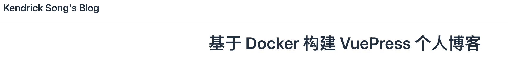
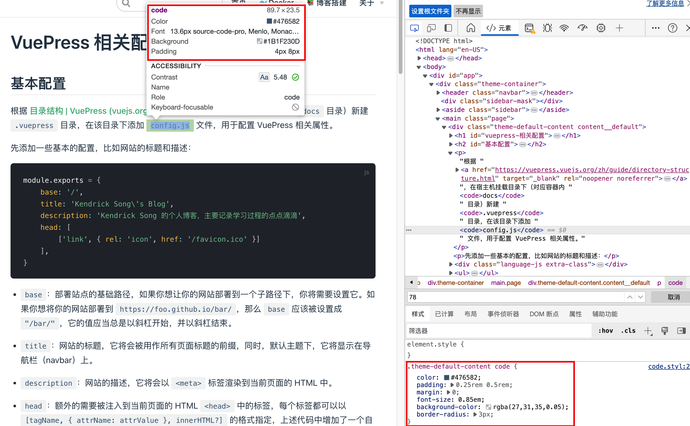
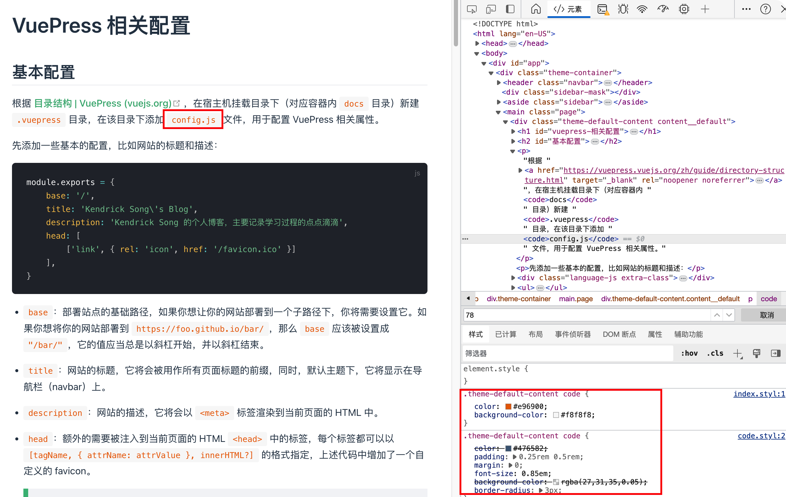
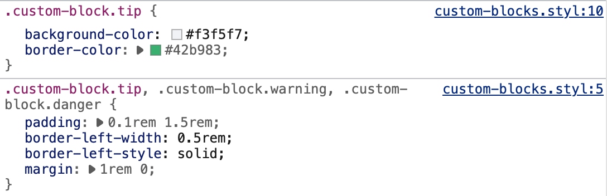
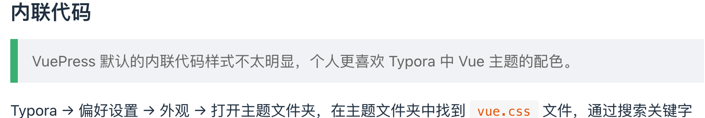
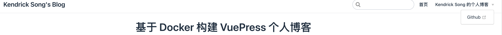
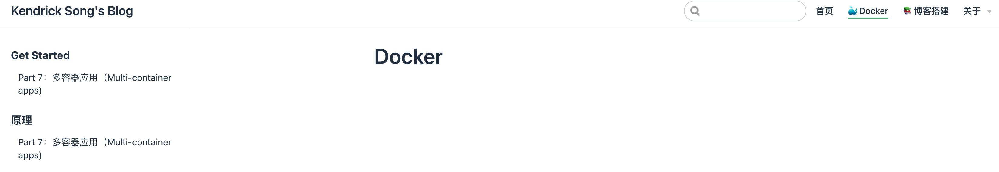
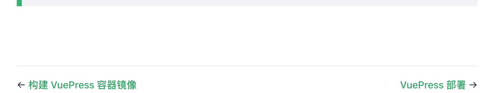
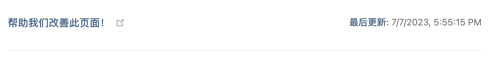
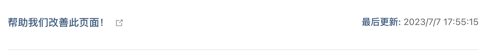

# VuePress 相关配置

[[toc]]

本文是在前文 [构建 VuePress 容器镜像](./构建%20VuePress%20容器镜像.md) 的基础上对 VuePress 进行相关配置，操作环境是在前文配置好的容器中。

::: tip 提示

更多 Markdown 拓展语法请参考 [Markdown 拓展 | VuePress (vuejs.org)](https://vuepress.vuejs.org/zh/guide/markdown.html#header-anchors)。

:::

## 基本配置

根据 [目录结构 | VuePress (vuejs.org)](https://vuepress.vuejs.org/zh/guide/directory-structure.html)，在宿主机挂载目录下（对应容器内 `docs` 目录）新建 `.vuepress` 目录，在该目录下添加 `config.js` 文件，用于配置 VuePress 相关属性。 

先添加一些基本的配置，比如网站的标题和描述：

```js
module.exports = {
    base: '/',
    title: 'Kendrick Song\'s Blog',
    description: 'Kendrick Song 的个人博客，主要记录学习过程的点点滴滴',
    head: [
        ['link', { rel: 'icon', href: '/favicon.ico' }]
    ],
}
```

- `base`：部署站点的基础路径，如果你想让你的网站部署到一个子路径下，你将需要设置它。如果你想将你的网站部署到  `https://foo.github.io/bar/`，那么  `base`  应该被设置成  `"/bar/"`，它的值应当总是以斜杠开始，并以斜杠结束。

- `title`：网站的标题，它将会被用作所有页面标题的前缀，同时，默认主题下，它将显示在导航栏（navbar）上。

- `description`：网站的描述，它将会以  `<meta>`  标签渲染到当前页面的 HTML 中。

- `head`：额外的需要被注入到当前页面的 HTML `<head>` 中的标签，每个标签都可以以 `[tagName, { attrName: attrValue }, innerHTML?]` 的格式指定，上述代码中增加了一个自定义的 favicon。

  ::: tip

  个人使用的 favicon 的生成网站：[Favicon.ico图标生成器 | 一键免费制作ico图标 - 标小智LOGO神器 (logosc.cn)](https://www.logosc.cn/logo/favicon)

  :::

使用 `docker restart` 命令重启容器，此时界面左上角会出现刚刚配置的网站标题，如下图所示。




::: tip ❓问题

虽然 VuePress 具有热重载的能力，但是有些时候配置文件好像并不能正确的热重载，只能重启容器/重新构建，~~后续再更改配置就可以热重载了，不需要重启容器。~~ 好像有点随缘，热部署没效果那就重启容器，重启解决 99% 的问题 😄。

:::

更多基础配置参考 [配置 | VuePress (vuejs.org)](https://vuepress.vuejs.org/zh/config/#基本配置)。

## 样式配置

VuePress 提供了一种添加额外样式的简便方法。你可以创建一个 `.vuepress/styles/index.styl` 文件。这是一个 [Stylus (opens new window)](http://stylus-lang.com/) 文件，但你也可以使用正常的 CSS 语法。

用户和主题的 `styles/index.styl` 都会被生成到最终的 CSS 文件中，但是默认情况下，用户的样式会生成在主题的样式后面，因此对于同样的选择器，**用户的样式将具有更高的优先级**。

具体执行逻辑请参考 [Overriding| VuePress (vuejs.org)](https://vuepress.vuejs.org/zh/miscellaneous/design-concepts.html#overriding)。

### 内联代码

> VuePress 默认的内联代码样式不太明显，个人更喜欢 Typora 中 Vue 主题的配色。

Typora → 偏好设置 → 外观 → 打开主题文件夹，在主题文件夹中找到 `vue.css` 文件，通过搜索关键字 code 和检查颜色是否匹配的方式，找到内联代码的样式配置，具体如下所示：

```css
#write code, tt {
    padding: 2px 4px;
    border-radius: 2px;
    font-family: var(--font-monospace);
    font-size: 0.92rem;
    color: #e96900;
    background-color: #f8f8f8;
}
```

现在我们得到了目标样式的字体颜色和背景颜色配置，下一步在 VuePress 进行配置。

首先通过浏览器的「检查」功能，我们可以得到元素的样式声明：




将元素的样式声明复制到 `index.styl` 文件中，即 `.theme-default-content code {}`。我们只想修改颜色和背景，所以仅保留 `color` 和 `background-color` 这两项即可。参考刚刚从 Typora 主题文件中得到的颜色，设置样式，具体如下所示：

```stylus
.theme-default-content code {
    color: #e96900;
    background-color: #f8f8f8;
}
```

`docker restart` 重启容器，查看效果：




可以看到样式覆盖成功了。

### 块引用

> VuePress 默认的块引用样式太不起眼了，可以将其修改为类似「提示引用块」的样式，但是不需要标题。

首先通过浏览器的「检查」功能获取到「提示引用块」的样式声明，如下图所示：




再获取到 Typora 中 Vue 主题的引用块样式，获取步骤和 [内联代码](#内联代码) 中相同，样式具体如下：

```css
blockquote {
    border-left: 4px solid #42b983;
    padding: 10px 15px;
    color: #777;
    background-color: rgba(66, 185, 131, .1);
}
```


我们取 Typora 中 Vue 主题引用块样式的 `color` 和 `padding`，其余部分和提示引用块相同，具体样式如下：

```stylus
blockquote {
    border-left-width: 0.5rem;
    border-left-style: solid;
    border-color: #42b983;
    background-color: #f3f5f7;
    padding: 10px 15px;
    color: #777;
}
```


将上述配置放入 `index.styl` 文件中，最后呈现结果如图所示：



## 默认主题配置

### 首页

VuePress 官方提供了一个基于  [YAML front matter](https://vuepress.vuejs.org/zh/guide/markdown.html#front-matter)   的主页模板，需要在根级 `README.md` 中指定 `home: true`。以下是一个如何使用的例子：

```markdown
---
home: true
heroImage: ./homepage.jpg
actionText: 快速开始 →
actionLink: /
features:
- title: 夯实基础
  details: 不积跬步无以至千里, 仰望星空还需脚踏实地
- title: 构建体系
  details: 告别碎片化学习，帮助构筑自己的知识体系
- title: 全栈开发
  details: 以 Java 开发为背景，全栈开发，DevOps
---

::: slot footer
MIT Licensed | Copyright © 2018-present [Kendrick-Song (github.com)](https://github.com/Kendrick-Song)
:::
```

其中，脚注部分使用 [Markdown Slot Syntax](https://vuepress.vuejs.org/zh/guide/markdown-slot.html) 来设置 ，以支持富文本。

::: tip 

如果遇到主页图片加载失败的问题，大概率是路径问题。主页图片应该放置于 `.vuepress/public` 文件夹下，图片的相对路径也是相对这个路径而言的。如上述示例中 `./homepage.jpg` 实际上是 `.vuepress/public/homepage.jpg`。

:::

更多配置参考 [首页 | VuePress (vuejs.org)](https://vuepress.vuejs.org/zh/theme/default-theme-config.html#首页)。

### 导航栏

导航栏可能包含页面标题、[搜索框](https://vuepress.vuejs.org/zh/theme/default-theme-config.html#搜索框)、 [导航栏链接](https://vuepress.vuejs.org/zh/theme/default-theme-config.html#导航栏链接)、[多语言切换](https://vuepress.vuejs.org/zh/guide/i18n.html)、[仓库链接](https://vuepress.vuejs.org/zh/theme/default-theme-config.html#git-仓库和编辑链接)，它们均取决于你的配置。修改 `config.js` ：

```js
module.exports = {
    ...
    // 默认主题配置
    themeConfig: {
        // 导航栏配置
        nav: [
            { text: '首页', link: '/' },
            {
                text: 'Kendrick Song 的个人博客',
                items: [
                    { text: 'Github', link: 'https://github.com/Kendrick-Song' },
                ]
            }
        ]

    }
    ...
}
```

效果如下图所示：




更多配置参考 [导航栏 | VuePress (vuejs.org)](https://vuepress.vuejs.org/zh/theme/default-theme-config.html#导航栏)。

### 侧边栏

这里使用了 [多个侧边栏 | VuePress (vuejs.org)](https://vuepress.vuejs.org/zh/theme/default-theme-config.html#多个侧边栏) 来配置，即不同的页面组显示不同的侧边栏，参考配置文件如下：

```js
// 侧边栏配置
sidebar: {
    '/🐳 Docker/': [
        {
            title: 'Get started',
            collapsable: false, // 可选的, 默认值是 true,
            sidebarDepth: 3,    // 可选的, 默认值是 1
            children: [
                'Get started/Part 7：多容器应用（Multi-container apps)',
            ],
        },
        {
            title: '原理',
            collapsable: false, // 可选的, 默认值是 true,
            sidebarDepth: 3,    // 可选的, 默认值是 1
            children: [
                'Part 7：多容器应用（Multi-container apps)',
            ],
        }
    ],
        '/📚 博客搭建/': [
            {
                title: '📚 博客搭建',
                collapsable: false, // 可选的, 默认值是 true,
                sidebarDepth: 3,    // 可选的, 默认值是 1
                children: [
                    '基于 Docker 构建 VuePress 个人博客',
                    '踩坑记录',
                ],
            }
        ]
}
```

结合导航栏，呈现出的效果大概是：




更多配置参考 [侧边栏 | VuePress (vuejs.org)](https://vuepress.vuejs.org/zh/theme/default-theme-config.html#侧边栏)。

### 最后更新时间

详细设置参考 [最后更新时间 | VuePress (vuejs.org)](https://vuepress.vuejs.org/zh/theme/default-theme-config.html#最后更新时间)。

::: warning 注意

此功能依赖于将整个项目构建为 Git 项目，在此之前页面底部不会显示时间，只会空出一部分。



Git 相关步骤参考 [VuePress 部署](./VuePress%20部署.md)。

配置完成后依然不显示更新时间，请参考 [由 lastUpdated 无效发现的 Docker 容器内 Git 仓库跨文件系统问题](./踩坑记录.md#由-lastupdated-无效发现的-docker-容器内-git-仓库跨文件系统问题)。

:::

配置完成后修改显示的时区，请参考 [lastUpdated 时区修改](./踩坑记录.md#lastupdated-时区修改)。

配置完成后日期格式不符合国人习惯，默认格式如下图：



一个简单的方法是在 `config.js` 中加上下面这段配置：

```js
module.exports = {
    ...
    locales: {
        '/': {
            lang: 'zh-CN',
        }
    },
    ...
}
```

这里实际上是对 VuePress 进行多语言配置，我们将默认博客路径配置为「中文」，所显示的日期格式就会自动变成中国习惯格式，如下图：



### 页面滚动

你可以通过 `themeConfig.smoothScroll` 选项来启用页面滚动效果。

```js
// .vuepress/config.js
module.exports = {
  themeConfig: {
    smoothScroll: true
  }
}
```

## 插件配置

### Tex 语法支持

默认情况下 VuePress 是不具备类似 Typora 的 Tex 语法公式解析的，在编写文档过程中多少会用到一些公式，故安装 [vuepress-plugin-mathjax | VuePress 社区 (vuepress-community.netlify.app)](https://vuepress-community.netlify.app/zh/plugins/mathjax/)。

在 [镜像构建](./构建%20VuePress%20容器镜像.md) 中我们已经安装过了插件相关依赖，只需要在 `config.js` 中配置一下即可，如下所示：

```js
// .vuepress/config.js
module.exports = {
  plugins: [
    [
      'vuepress-plugin-mathjax',
      {
        target: 'svg',
        macros: {
          '*': '\\times',
        },
      },
    ],
  ],
}
```

简单测试一下：输入 `$a_1+b_1=c_1$`，结果为 $a_1+b_1=c_1$。

::: tip

若热重载没有效果，使用 `docker restart` 命令重启容器即可。

:::